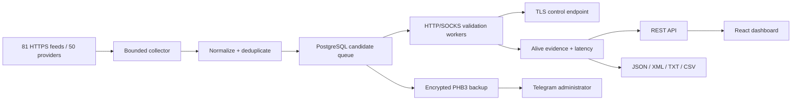

# ProxyHarbor

Высокопроизводительный сервис на ASP.NET Core 10, React 19 и PostgreSQL для сбора, объективной проверки и публикации бесплатных публичных HTTP(S), SOCKS4 и SOCKS5 прокси.

ProxyHarbor загружает 81 HTTPS-feed от 50 независимых провайдеров, нормализует и дедуплицирует адреса, проверяет их через настоящий proxy-туннель до доверенного TLS endpoint, измеряет задержку и отдаёт только свежие подтверждённые прокси через API и экспорты JSON, XML, TXT и CSV.

> Публичные прокси принадлежат третьим лицам и могут читать или изменять незашифрованный трафик. Не передавайте через них пароли, cookies, платёжные данные и другие секреты. Используйте сервис законно и соблюдайте условия источников и целевых ресурсов.

## Состояние проекта

- 81 встроенный feed от 50 провайдеров; полный каталог: [docs/SOURCE_CATALOG.md](docs/SOURCE_CATALOG.md).
- Последний независимый live-аудит feed endpoint: 81/81 успешно, 0 ошибок.
- Последний полный production-цикл: 888 116 разобранных строк, 290 217 уникальных кандидатов за 4,965 секунды.
- Проверочная партия: 1 600/1 600 результатов, без `Deferred`; одинаковый набор Alive во всех четырёх форматах.
- Backend: 598 автоматических тестов; meaningful coverage — 89,21% строк и 80,21% ветвей.
- Frontend: Vitest, ESLint, TypeScript production build и axe-core accessibility gate.
- Release build компилируется с warnings-as-errors и обязательной XML-документацией публичного production API.
- CI проверяет PostgreSQL migrations, backup/restore, OpenAPI, Docker Compose, security contracts, зависимости и Git-историю.

Результаты конкретного аудита описаны в [docs/SOURCES.md](docs/SOURCES.md) и [docs/PERFORMANCE.md](docs/PERFORMANCE.md). Это воспроизводимые измерения, а не гарантия постоянной доступности сторонних бесплатных прокси.

## Возможности

- параллельный bounded-сбор источников с retry, exponential backoff, ETag/Last-Modified и аудитом полноты;
- строгий parser `IP:port` и `scheme://IP:port`, защита от HTML/WAF-ответов, private/special-use адресов и DNS rebinding;
- allocation-conscious дедупликация и PostgreSQL binary COPY для больших циклов;
- проверка HTTP CONNECT, SOCKS4a и SOCKS5 через TLS 1.2/1.3 до контрольного endpoint;
- измерение полной latency, exit IP, анонимности, success rate и адаптивное расписание повторных проверок;
- горизонтально масштабируемая очередь через lease token и `FOR UPDATE SKIP LOCKED`;
- публичная keyset pagination и потоковый экспорт до 50 000 строк за запрос;
- React-панель со статистикой, каталогом провайдеров и защищённым административным режимом;
- OpenAPI, Prometheus-метрики, готовые alerts и operator diagnostics;
- PHB3 backup БД и безопасных настроек: diskless ZIP → AES-256-GCM → self-verification → atomic publish → Telegram;
- транзакционный restore всех пяти таблиц с проверкой архива, semantic invariants и полным rollback при ошибке;
- hardened Docker deployment: non-root, read-only root filesystem, dropped capabilities, healthchecks и resource ceilings;
- multi-architecture GHCR release workflow с SBOM, provenance и immutable image digests.

## Как работает ProxyHarbor



Collector отвечает только за обнаружение адресов. Proxy не публикуется как Alive, пока validator не построит реальный туннель, не завершит TLS-проверку доверенного сертификата и не получит канонический внешний IP. Недоступность контрольного endpoint даёт нейтральный `Deferred`, а не ложный Dead.

Подробности: [архитектура](docs/ARCHITECTURE.md), [источники](docs/SOURCES.md), [производительность](docs/PERFORMANCE.md).

## Быстрый запуск через Docker

Требования:

- Docker Engine 26+;
- Docker Compose 2.24.4+;
- минимум 4 ГБ RAM для стандартных лимитов;
- доступ к PostgreSQL и внешним HTTPS endpoint из контейнерной сети.

```bash
git clone https://github.com/YOUR_GITHUB_OWNER/ProxyHarbor.git
cd ProxyHarbor
cp .env.example .env
```

Замените обязательные значения в `.env`:

```dotenv
POSTGRES_PASSWORD=REPLACE_ME
ADMIN_API_KEY=REPLACE_ME
BACKUP_ENCRYPTION_KEY=REPLACE_ME
TELEGRAM_BOT_TOKEN=REPLACE_ME
TELEGRAM_CHAT_ID=-1001234567890
```

Запустите локальный HTTP-контур:

```bash
docker compose up -d --build
docker compose ps
curl --fail http://localhost:8080/health/ready
```

После первого старта:

- панель: <http://localhost:8080>;
- OpenAPI: <http://localhost:8080/openapi/v1.json>;
- readiness: <http://localhost:8080/health/ready>;
- liveness: <http://localhost:8080/health/live>;
- локальные метрики: <http://localhost:8080/metrics>.

Первый публичный список появится после сбора и проверки кандидатов. Текущее состояние видно в панели, `/api/v1/stats` и admin diagnostics.

## Production HTTPS

Создайте DNS A/AAAA-запись, откройте TCP 80/443 и UDP 443, затем задайте в `.env`:

```dotenv
PUBLIC_HOST=proxy.example.com
ACME_EMAIL=admin@example.com
```

Запуск:

```bash
docker compose -f docker-compose.yml -f docker-compose.production.yml up -d --build
curl --fail https://proxy.example.com/health/ready
```

Production overlay:

- принудительно включает encrypted backup и Telegram delivery;
- убирает прямую публикацию frontend-порта `8080`;
- оставляет единственной публичной точкой входа hardened Caddy;
- автоматически получает и продлевает TLS-сертификаты;
- не публикует `/metrics` через gateway;
- использует Compose secrets вместо secret values в environment контейнеров.

Полная процедура, firewall, restore drill и обновление: [docs/DEPLOYMENT.md](docs/DEPLOYMENT.md).

## Публичный API

```text
GET /api/v1/proxies
GET /api/v1/proxies/seek
GET /api/v1/export/{json|xml|txt|csv}
GET /api/v1/export/{json|xml|txt|csv}/seek
GET /api/v1/sources
GET /api/v1/stats
GET /health/live
GET /health/ready
GET /metrics
GET /openapi/v1.json
```

Примеры:

```bash
curl 'http://localhost:8080/api/v1/proxies?protocol=Socks5&maxLatencyMs=1000&pageSize=100'
curl 'http://localhost:8080/api/v1/proxies/seek?minSuccessRate=80&pageSize=500'
curl -OJ 'http://localhost:8080/api/v1/export/csv?maxLatencyMs=1500&limit=50000'
curl 'http://localhost:8080/api/v1/sources'
curl 'http://localhost:8080/api/v1/stats'
```

Для длинного обхода используйте seek endpoint и возвращаемый `nextCursor`/`X-Next-Cursor`. Cursor подписывает позицию и fingerprint фильтров; повреждённое значение или повторное использование с другими фильтрами возвращает `400`.

Полный контракт фильтров, форматов, заголовков, ошибок и rate limits: [docs/API.md](docs/API.md).

## Административный API

Все маршруты требуют заголовок `X-Admin-Key`:

```text
GET    /api/v1/admin/sources
GET    /api/v1/admin/sources/{id}
POST   /api/v1/admin/sources
PUT    /api/v1/admin/sources/{id}
DELETE /api/v1/admin/sources/{id}
GET    /api/v1/admin/diagnostics
POST   /api/v1/admin/collect
POST   /api/v1/admin/validate
POST   /api/v1/admin/backup
```

```powershell
$adminHeaders = @{ 'X-Admin-Key' = $env:ADMIN_API_KEY }
Invoke-RestMethod http://localhost:8080/api/v1/admin/diagnostics -Headers $adminHeaders
Invoke-RestMethod http://localhost:8080/api/v1/admin/collect -Method Post -Headers $adminHeaders
```

Передавайте ключ только через HTTPS. Ответы admin API получают `Cache-Control: no-store`; middleware ограничивает размер и число header values и сравнивает SHA-256 в constant time.

## Backup и восстановление

Backup содержит:

- прокси и их полную validation-статистику;
- встроенные и пользовательские источники;
- collection, validation и backup audit;
- полные безопасные `Collector`/`Backup`/runtime-настройки;
- manifest версии 5 с явным `secretsIncluded=false`.

В архив никогда не входят admin key, PostgreSQL connection string/password, Telegram token/chat ID и encryption key. Их нужно хранить отдельно в secret manager.

Ручной backup:

```powershell
$adminHeaders = @{ 'X-Admin-Key' = $env:ADMIN_API_KEY }
Invoke-RestMethod https://proxy.example.com/api/v1/admin/backup -Method Post -Headers $adminHeaders
```

Inspection без подключения к БД:

```bash
docker compose --profile tools run --rm --no-deps -T restore \
  --input /app/backups/proxyharbor-YYYYMMDD-HHMMSS-ffff.phbackup \
  --inspect-settings > recovery-settings.json
```

Destructive restore выполняйте только после остановки API и пробного восстановления в отдельную БД:

```bash
docker compose stop web api
docker compose --profile tools run --rm restore \
  --input /app/backups/proxyharbor-YYYYMMDD-HHMMSS-ffff.phbackup \
  --replace-existing-data
docker compose up -d api web
```

Криптография, Telegram parts, аудит и disaster-recovery procedure: [docs/BACKUP_RESTORE.md](docs/BACKUP_RESTORE.md).

## Конфигурация

Docker-пользователю обычно достаточно `.env.example`. API поддерживает стандартную ASP.NET Core конфигурацию: `Collector__ValidationConcurrency` соответствует `Collector:ValidationConcurrency`.

Ключевые параметры:

| Параметр | По умолчанию | Назначение |
|---|---:|---|
| `BACKGROUND_WORKERS_ENABLED` | `true` | Collector/validator workers этой реплики |
| `VALIDATION_CONCURRENCY` | `800` | Одновременные proxy probes |
| `VALIDATION_BATCH_SIZE` | `1600` | Размер одной lease-партии |
| `BACKUP_ENABLED` | `true` в `.env.example` | Плановый PHB3 backup |
| `BACKUP_HISTORY_RETENTION_DAYS` | `365` | История backup audit |
| `BACKEND_SUBNET` | `172.30.0.0/24` | Единственная trusted proxy network |
| `PUBLIC_HOST` | — | Production hostname без схемы |
| `ACME_EMAIL` | — | Контакт ACME |

Полный справочник с диапазонами, defaults и secret-file mapping: [docs/CONFIGURATION.md](docs/CONFIGURATION.md).

## Наблюдаемость

Opt-in monitoring profile запускает Prometheus и Alertmanager только на loopback хоста:

```bash
docker compose -f docker-compose.yml -f docker-compose.production.yml \
  --profile monitoring up -d --build
```

- Prometheus: `127.0.0.1:9090`;
- Alertmanager: `127.0.0.1:9093`;
- retention ограничен временем и размером;
- Telegram firing/resolved уведомления используют Compose secrets;
- alerts покрывают stale collection, validation backlog, backup RPO/delivery, source completeness, PostgreSQL readiness, API 5xx/p95 и advisory-lock cleanup.

Метрики и действия по каждому alarm: [docs/MONITORING.md](docs/MONITORING.md).

## Локальная разработка

Требования:

- .NET SDK из [global.json](global.json);
- Node.js 22;
- PostgreSQL 17;
- PowerShell 7 для operator/contract scripts.

Backend:

```powershell
dotnet restore ProxyHarbor.slnx --locked-mode
dotnet build ProxyHarbor.slnx -c Release --no-restore
$env:PROXYHARBOR_INTEGRATION_POSTGRES='Host=localhost;Database=proxyharbor_test;Username=postgres;Password=...'
dotnet test ProxyHarbor.slnx -c Release --no-build
dotnet format ProxyHarbor.slnx --verify-no-changes --no-restore
```

Frontend:

```bash
cd src/proxyharbor-web
npm ci
npm test
npm run lint
npm run build
```

Полный локальный gate и правила изменений: [CONTRIBUTING.md](CONTRIBUTING.md).

## Структура репозитория

```text
src/ProxyHarbor.Domain/          доменные сущности и публичные контракты
src/ProxyHarbor.Infrastructure/  PostgreSQL, collector, validator, backup
src/ProxyHarbor.Api/             REST/OpenAPI, middleware, metrics
src/ProxyHarbor.Restore/         inspect/restore CLI
src/proxyharbor-web/             React + TypeScript + Vite
tests/ProxyHarbor.Tests/         unit, transport и PostgreSQL integration tests
deploy/                          Caddy, Prometheus и Alertmanager configuration
tools/                           audits, backup utilities и release contracts
docs/                            архитектура и operator runbooks
.github/                         CI, CodeQL, Dependabot и contribution templates
```

## Документация

Начните с [индекса документации](docs/README.md):

- [что уже реализовано и проверено](docs/PROJECT_STATUS.md);
- [архитектура и модель данных](docs/ARCHITECTURE.md);
- [полный API](docs/API.md);
- [полная конфигурация](docs/CONFIGURATION.md);
- [backup и restore](docs/BACKUP_RESTORE.md);
- [production deployment](docs/DEPLOYMENT.md);
- [мониторинг и incident runbook](docs/MONITORING.md);
- [производительность](docs/PERFORMANCE.md);
- [источники и live audit](docs/SOURCES.md);
- [топ-50 провайдеров](docs/SOURCE_CATALOG.md);
- [выпуск версии](docs/RELEASING.md);
- [первая публикация на GitHub](docs/GITHUB_SETUP.md);
- [политика безопасности](SECURITY.md);
- [история изменений](CHANGELOG.md).

## Подготовка к публикации

Перед первым push:

```powershell
./tools/Test-PublicationReadiness.ps1 -RequireCleanWorktree
./tools/Invoke-Gitleaks.ps1
./tools/Invoke-Actionlint.ps1
```

Затем выполните [полный GitHub checklist](docs/GITHUB_SETUP.md): создайте пустой remote, включите Actions/CodeQL/secret scanning, настройте branch и tag rulesets, дождитесь успешного CI и только после container smoke создавайте первый SemVer tag.

До публикации замените `YOUR_GITHUB_OWNER` в команде клонирования на фактического владельца репозитория. Runtime-примеры с `proxy.example.com` являются шаблонами и заменяются на `PUBLIC_HOST` вашей установки.

## Безопасность и поддержка

- Уязвимости: [SECURITY.md](SECURITY.md). Не публикуйте секреты и exploit details в issue.
- Пользовательская помощь: [SUPPORT.md](SUPPORT.md).
- Участие в разработке: [CONTRIBUTING.md](CONTRIBUTING.md).
- Правила сообщества: [CODE_OF_CONDUCT.md](CODE_OF_CONDUCT.md).

## Лицензия

Код ProxyHarbor распространяется по лицензии [MIT](LICENSE). Внешние proxy-feed и возвращаемые ими данные принадлежат соответствующим владельцам; списки прокси не включаются в Git-репозиторий и загружаются только во время работы сервиса.
