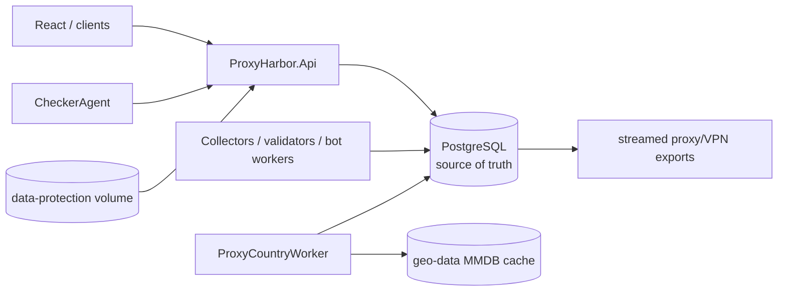
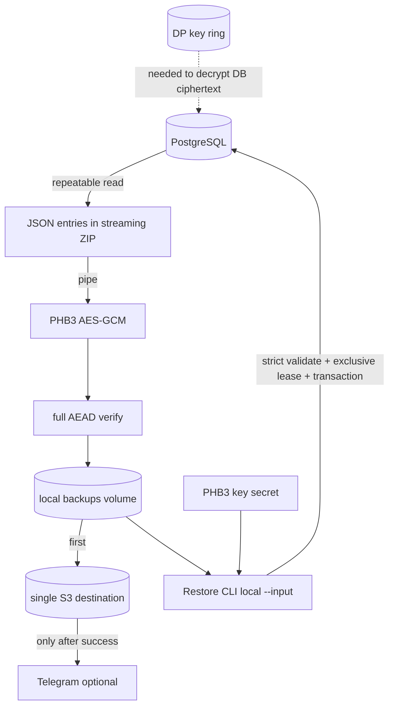
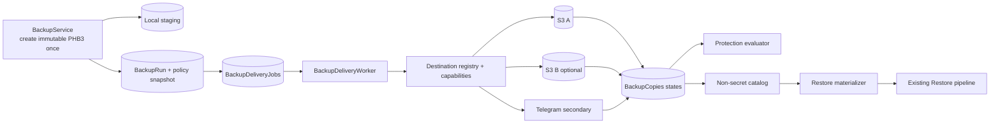
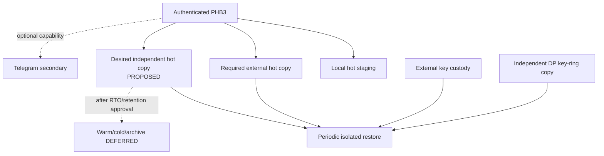
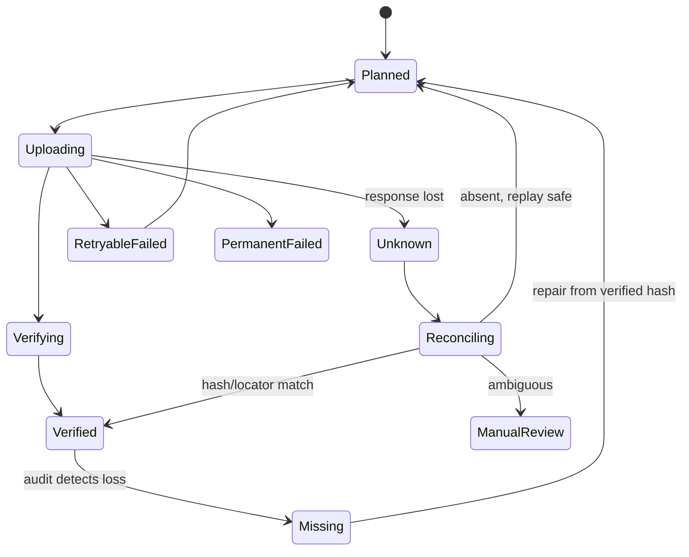
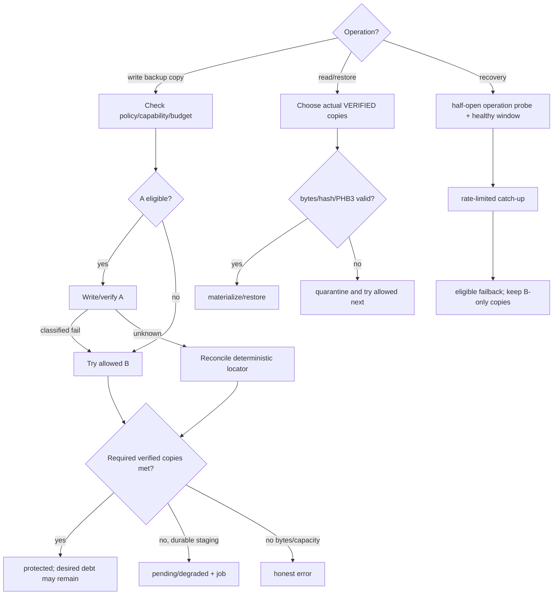

# Полный аудит хранилищ ProxyHarbor

Дата: 2026-09-22. Режим: `ANALYZE_AND_PLAN_ONLY`. Baseline: `main@cafb95c38047f7031161fb3017774444f0da3bfb`, исходное дерево чистое. Production/VPS и реальные storage accounts не исследовались. Подробные доказательства — [STORAGE_EVIDENCE.md](STORAGE_EVIDENCE.md), риски — [STORAGE_RISK_REGISTER.md](STORAGE_RISK_REGISTER.md).

## 1. Executive Summary

ProxyHarbor не является файловым сервисом: основной source of truth — PostgreSQL; proxy/VPN exports генерируются из БД, GeoIP — воспроизводимый cache, frontend — build artifact. Реальный storage integration для durable content — pipeline резервных копий: локальный PHB3 volume, один S3-compatible destination и Telegram как non-S3 delivery channel.

Сильные стороны baseline: repeatable-read snapshot, потоковое PHB3 шифрование, проверка целостности до atomic publish, cluster locks, retention, transactional restore, CI restore smoke, S3 `PUT+HEAD` и Telegram confirmation. Главный вывод аудита — production baseline v7 нельзя считать полным disaster backup. В текущей feature-ветке этот разрыв уже исправлен строгим v8 и локально подтверждён PostgreSQL round-trip, но до CI и выпуска production по-прежнему создаёт v7 (RISK-001/RISK-003).

Multi-storage failover не реализован. Конфигурация содержит ровно один S3; S3 вызывается раньше Telegram, поэтому отказ S3 блокирует попытку через здоровый Telegram. Нет durable per-copy jobs, UNKNOWN reconciliation, remote retrieval, независимого каталога или автоматического repair. Потеря VPS также затрагивает PostgreSQL, local backup и Data Protection keys; внешняя сохранность PHB3 key/key ring не подтверждена.

Рекомендация: (1) немедленно выпустить exhaustive manifest/restore v8; (2) добавить PostgreSQL-backed `BackupCopies`/jobs и N destinations, сохранив legacy S3/Telegram contracts; (3) remote materialization/catalog и isolated restore drill; (4) canary/observation. Generic runtime object platform и новые cloud adapters сейчас не нужны.

## 2. Repository/Service Map, baseline и границы

| Компонент | Роль в данных/хранении |
|---|---|
| `ProxyHarbor.Api` | HTTP/admin/metrics/Telegram; local backup download; Data Protection setup. |
| `ProxyHarbor.Infrastructure` | EF/PostgreSQL, collectors, backup/encryption/S3, GeoIP cache, workers. |
| `ProxyHarbor.Domain` | Entities, включая `BackupRun` и источники. |
| `ProxyHarbor.Restore` | Offline PHB2/PHB3 decrypt, strict archive validation, transactional DB replacement. |
| `ProxyHarbor.CheckerAgent` | Stateless/remote checker; token file secret, результаты в API/DB. |
| `proxyharbor-web` | Static React build; admin UI backup settings/history. |
| Compose/deploy | PostgreSQL/local volumes, restore tool, monitoring, systemd predeploy retention. |
| CI | Unit/integration, container local backup/restore smoke, PostgreSQL round-trip. |

Охвачены собственный код, tests, migrations/model snapshot, DI, Compose/workflows, deploy/tools/docs и Git history. Исключены generated `bin/obj/node_modules`, package bodies и реальные providers/VPS. Managed DB backup, provider bucket settings, actual versioning/Object Lock, secret manager, key custody, volumes, schedules and production logs — `NOT VERIFIED`.

## 3. Data Classification Matrix

| Data class | Create/read/update/delete | Source of truth | Критичность | Backup status |
|---|---|---|---|---|
| Proxy/VPN catalog, sources, run history | collectors/admin/API/validators через EF | PostgreSQL | High, частично воспроизводимо, но history/config нет | Основные tables в v7; `ProxySourceCredentials` пропущена. |
| Accounts, roles, subscriptions/payments | Identity/payment/Telegram flows | PostgreSQL | Critical | Users/roles/userroles/subscriptions/payment orders есть; API tokens, token requests, Identity auxiliaries пропущены. |
| Referrals/rewards | Telegram/account flows | PostgreSQL | High/financial | Пропущены. |
| Telegram CRM/queue/config | Bot workers/controllers | PostgreSQL; secrets as DP ciphertext | High | Есть, но decrypt зависит от external DP key ring. |
| Payment/site/backup config | Config stores | PostgreSQL; secrets as DP ciphertext | Critical | Есть; DP keys/secret refs не входят. |
| Metrics snapshot state | metrics snapshot service | PostgreSQL | Medium | Пропущена; reconstructible operational state, но классификация отсутствует. |
| Validation leases | workers | PostgreSQL ephemeral ownership | Low/deliberately ephemeral | Правильно не backup'ятся; restore должен очищать lease. |
| PHB3 archive | `BackupService` | Immutable local ciphertext + external copy | Critical DR artifact | Local/S3/Telegram delivery. |
| Backup audit/catalog | `BackupRuns` | PostgreSQL | High | Предыдущие rows входят, но restore теряет S3 fields; catalog зависит от потерянной БД. |
| PHB3 encryption key | Docker secret/external custody | External secret | Critical | Не входит (правильно); custody `NOT VERIFIED`. |
| Data Protection key ring | filesystem volume | `data-protection` volume | Critical recovery dependency | Не входит; independent copy `NOT VERIFIED`. |
| Provider credentials | DP ciphertext/Docker secret | DB/secret files | Critical secret | Не должны попадать в reports/catalog; recovery requires DP keys/reprovision. |
| Predeploy `pg_dump` | operator script | `/opt/proxyharbor` local file | High rollback artifact | Local, `0600`, unencrypted by app, same host. |
| GeoIP MMDB | downloaded worker | local `geo-data` cache/upstream DB-IP | Low/reconstructible | Не нужен в DR backup. |
| Prometheus/Alertmanager/Caddy state | respective services | local volumes | Operational | В PHB3 не входит; desired backup `NOT VERIFIED`. |
| Frontend/static/QR/export outputs | build/resource/in-memory/HTTP stream | repo/DB | Rebuildable | Separate file backup not required. |

## 4. Storage Provider Matrix

| Backend | Реально wired | Workload | Write | Verify/read | Failure domain | Evidence level |
|---|---|---|---|---|---|---|
| PostgreSQL | Да | runtime source of truth, audit/jobs/config | EF/Npgsql | SQL/readiness/transactions | current Compose host | CODE+CI; production `NOT VERIFIED` |
| Local `backups` volume | Да | PHB3 staging/hot local | atomic file publish | PHB3 verify, admin Range download | same VPS | CODE+CI |
| S3-compatible | Да, один | encrypted PHB3 delivery | `PutObject` | `HeadObject` size + metadata SHA-256 | external if configured so | CODE; real account `NOT VERIFIED` |
| Telegram Bot API | Да | additional PHB3 delivery | `sendDocument`, ≤20 parts | response `ok`; no later byte read | Telegram/account | CODE/tests; real delivery `NOT VERIFIED` |
| Data Protection volume | Да | crypto key ring | ASP.NET Core | local key repository | same VPS unless copied | CODE/config |
| GeoIP volume | Да | reconstructible MMDB | bounded HTTP download/atomic replace | MaxMind format/read | same VPS/upstream | CODE |
| Local `/opt` | Operator path | predeploy `pg_dump` | `pg_dump -Fc`/hard-link | `pg_restore --list` | same VPS | CODE/config; installed timer `NOT VERIFIED` |
| Google Drive/Yandex Disk/Mail Cloud/OneDrive/Dropbox/WebDAV/SFTP/Azure/rclone | Нет найденного adapter/wiring | — | — | — | — | NOT IMPLEMENTED; external automation `NOT VERIFIED` |

Yandex Object Storage появляется только как пример S3-compatible endpoint, не как Yandex Disk adapter.

## 5. Current Runtime Architecture

Нет object-backed runtime file read/write path, logical object IDs, user uploads или attachment metadata. Поэтому read/write failover текущей business data означает PostgreSQL HA, а не S3 routing; это отдельная infrastructure problem (RISK-018). Для backup objects read/write failover применим и нужен.

## 6. Current Backup/Restore Architecture

Backup run is `completed` only after every configured serial channel succeeds. S3 delivery is recorded before Telegram; partial success is visible in booleans, but not independently retried. Local retention runs even on external failure. Restore supports local archive only and no provider retrieval.

## 7. Storage Policy Matrix

| Operation | Current policy | Result |
|---|---|---|
| Runtime DB read/write | Single PostgreSQL connection | No automatic DB failover in app. |
| Create backup bytes | Local absolute directory, one snapshot at a time | Strong integrity; local host dependency. |
| Deliver backup | All configured channels serially required | Not fallback; healthy later channel may never run. |
| Read backup for admin | Local file only | External-only copy unavailable in UI. |
| Read backup for restore | Operator-provided local path | Remote retrieval manual/out-of-band. |
| Retention | Local days/count + DB audit days | No remote lifecycle verification or independent-copy guard. |
| Repair | New full snapshot on retry | No copy-level catch-up/reconciliation. |

Target policy is defined by DEC-006/007: required verified external copy count distinct from desired redundancy; no silent downgrade.

## 8. Backup Tier Matrix

| Tier | Current | Target/recommendation |
|---|---|---|
| Local staging/hot | PHB3 volume, default 7 days | Keep for fast admin/restore; do not count as independent offsite. |
| External hot | Single S3 and/or Telegram | At least one verified S3-compatible hot copy; desired second independent copy `PROPOSED`. |
| Warm/cold | None | `DEFERRED`; no RTO/provider restore-time evidence. |
| Archive/immutable | Docs recommend versioning/Object Lock | Capability/bucket state `NOT VERIFIED`; verify before policy credit. |
| Predeploy rollback | Local custom-format dump, keep 7 | Keep separate, short-lived; not DR tier. |

## 9. Multi-storage capability and failover

| Capability | Implementation | Operational evidence | Finding |
|---|---|---|---|
| Single S3 delivery | IMPLEMENTED | VERIFIED BY CODE/LOCAL TESTS | No real provider evidence. |
| Telegram delivery | IMPLEMENTED | VERIFIED BY TEST | Native non-S3 preserved. |
| Multiple configured S3/providers | NOT IMPLEMENTED | NOT VERIFIED | One options object/adapter. |
| Per-workload pools | NOT IMPLEMENTED | NOT VERIFIED | Only backup options; no pool. |
| Automatic backup fallback | BROKEN vs owner requirement | VERIFIED BY CODE | S3 failure stops before Telegram. |
| Partial success tracking | PARTIALLY IMPLEMENTED | VERIFIED BY CODE | Booleans, no copy records/jobs. |
| UNKNOWN outcome | NOT IMPLEMENTED | NOT VERIFIED | No reconcile. |
| Read failover for restore/download | NOT IMPLEMENTED | NOT VERIFIED | Local path only. |
| Write failover for backup copies | NOT IMPLEMENTED | NOT VERIFIED | Serial all-configured semantics. |
| Durable async replication/catch-up | NOT IMPLEMENTED | NOT VERIFIED | Worker recreates snapshots. |
| Repair/failback/anti-flapping | NOT IMPLEMENTED | NOT VERIFIED | No health/copy generation. |
| All-failed bounded mode | PARTIALLY IMPLEMENTED | VERIFIED BY CODE | Local retention bounded; no staging capacity/backpressure contract. |
| Cross-instance consistency | PARTIALLY IMPLEMENTED | VERIFIED BY CODE/TEST | Snapshot locks; no per-copy leases. |
| Non-S3 regression preservation | PARTIALLY IMPLEMENTED | VERIFIED BY TEST | Telegram tests strong; no new routing baseline yet. |

## 10. Data Integrity and Reconciliation

Local PHB3 integrity is strong: authenticated chunks/final marker, full reread, atomic rename, strict ZIP entry/size validation and repeatable-read DB snapshot. S3 verifies size and client-computed SHA-256 metadata after upload. Missing controls:

- no native checksum/version ID in audit;
- no conditional create contract;
- no durable copy generation/state;
- no reconcile after lost response/crash;
- no authoritative inventory comparing DB/local/S3/Telegram;
- no quarantine/repair selection;
- no automatic proof that remote copy can be downloaded and decrypted.

## 11. Upload/Download Architecture

- Runtime proxy export is bounded streaming from PostgreSQL, not stored upload/download.
- VPN export buffers a bounded generated response; also not durable file storage.
- Admin backup download is proxy download from local file with Range.
- Backup upload to S3 streams local ciphertext through AWS SDK; Telegram streams file/parts with retry.
- Presigned URLs, direct upload, multipart/resumable sessions and remote Range are absent. For current workload they are `NOT_REQUIRED`; remote restore can safely materialize through server/operator path.

## 12. Delete, retention and immutability

Local cleanup scopes names precisely and avoids unrelated files. Local published retention and audit retention are separate. Admin may delete local file/audit. Remote delete is absent, which is safer than uncoordinated cleanup but means lifecycle is external. Versioning/Object Lock are recommendations only; no code verifies them. Target initial release must not automate remote delete, and later retention must require independent verified points before deletion.

## 13. Backup Analysis

Two distinct pipelines exist:

1. Application PHB3: portable logical JSON, encrypted and externally deliverable. Good for app-aware restore, currently incomplete due schema drift.
2. Predeploy `pg_dump -Fc`: DB-complete at PostgreSQL level, local and short-lived, used as deploy rollback. It is not PHB3 encrypted/offsite and is in the same host failure domain.

Neither alone currently proves full independent DR: PHB3 omits data; pg_dump is local. A recent verified pg_dump could mitigate RISK-001 for a deploy rollback, but its production existence/freshness is `NOT VERIFIED` and it is not a substitute for repaired PHB3.

## 14. Restore and DR Analysis

Implementation is mature for the included v7 subset: strict archive validation before destructive work, migrations, exclusive runtime lease, one transaction and cleanup-aware exit. CI executed an actual local encrypted backup→restore and verified representative data on current commit. Gaps:

- incomplete data set and old `BackupRun` field mapping;
- remote provider retrieval/catalog absent;
- external key/key-ring availability unproven;
- no production-like isolated restore from last offsite copy;
- no measured RPO/RTO/application business smoke across all critical features;
- target DB migrations before import can create new tables whose current data remains or is cleared inconsistently.

## 15. Migration Capability

No storage object migration framework exists. Current S3 keys are safe legacy locators; new model needs inventory, shadow rows, dual-read, verified backfill and delta reconciliation. Because archives are immutable, migration can be copy+verify without in-place mutation. Rollback cannot be simple flag-off after B-only writes unless compatibility materialization remains enabled.

## 16. Security Findings

Positive controls: secret files, Data Protection ciphertext, no credentials returned to browser, HTTPS-only S3 endpoint validation, PHB3 encryption, secret redaction tests, read-only containers/cap drop. Risks:

- recovery depends on independently unavailable key ring/key;
- predeploy dump is plaintext-at-rest from application perspective;
- real bucket privacy/versioning/Object Lock/IAM not verified;
- S3 endpoint allowlist/SSRF defense deserves provider-aware review;
- common VPS/root/account failure can affect several controls at once.

## 17. Performance and cost drivers

Current backup streams large tables and avoids retry-strategy buffering. Main future drivers: database snapshot scan, local ciphertext space, external egress, repeated full snapshot after delivery failure, S3 request/HEAD cost, Telegram part count, backfill bandwidth and repair backlog. Target must reuse immutable bytes, cap concurrency/RAM/disk/overall deadlines, prioritize newest unprotected backups and rate-limit repair. Provider prices were not researched and must not be guessed.

## 18. Observability

Existing alerts cover configuration unreadable, last run failed, stale and hung; Telegram delivery has a dedicated alert. Missing: S3 last-success, copy count, protection/degraded state, debt age, UNKNOWN, breaker/recovery, staging quota, remote restore readiness, last drill, key custody. Monitoring resides on the same VPS unless externalized.

## 19. Gap Analysis

Legend: implementation / evidence.

| Area | Status | Evidence |
|---|---|---|
| DB backup bytes/integrity | PARTIALLY IMPLEMENTED | VERIFIED BY TEST; completeness BROKEN |
| Full DB restore | BROKEN | VERIFIED BY CODE/coverage comparison |
| File backup | NOT_REQUIRED for durable runtime files | VERIFIED BY CODE discovery; external systems NOT VERIFIED |
| Hot local backup | IMPLEMENTED | VERIFIED BY TEST |
| Independent hot copy | PARTIALLY IMPLEMENTED | CONFIG/CODE ONLY; actual account NOT VERIFIED |
| Multiple destinations/copies | NOT IMPLEMENTED | CODE |
| Backup destination fallback | NOT IMPLEMENTED | CODE |
| Backup chain continuity | NOT APPLICABLE to full-snapshot PHB3; copy continuity missing | CODE |
| Per-copy status/reconciliation | NOT IMPLEMENTED | CODE |
| Strong local checksum/AEAD | IMPLEMENTED | VERIFIED BY TEST |
| Remote native checksum/version | NOT IMPLEMENTED | CODE |
| Direct download/upload | NOT_REQUIRED now | No runtime object workload |
| Proxy backup download | PARTIALLY IMPLEMENTED | Local only, VERIFIED BY TEST |
| Range | IMPLEMENTED local admin download | CODE/TEST |
| Retention | PARTIALLY IMPLEMENTED | Local/audit yes, remote safe policy no |
| Versioning/Object Lock | NOT IMPLEMENTED in app | Docs only, provider NOT VERIFIED |
| Backup catalog outside DB | NOT IMPLEMENTED | CODE |
| Automated restore verification | PARTIALLY IMPLEMENTED | CI local; real offsite NOT VERIFIED |
| Migration dry-run/resume/delta | NOT IMPLEMENTED | — |
| Least privilege | PARTIALLY IMPLEMENTED | Config validation/docs; real IAM NOT VERIFIED |
| DR runbook | PARTIALLY IMPLEMENTED | Local procedure documented; remote dependencies missing |
| Non-S3 preservation | IMPLEMENTED baseline | Telegram unit/contract tests; future routing gate required |

## 20. Recommended Target Architecture

### Target Backup/Tiering Architecture

### Target Replication and Repair Flow

### Target Migration and Cutover Flow

```mermaid
flowchart LR
  V8[Fix v8 completeness] --> SCHEMA[Add destinations/copies/jobs flag off]
  SCHEMA --> SHADOW[Legacy inventory + shadow rows]
  SHADOW --> CANARY[Manual canary dual delivery]
  CANARY --> BACKFILL[Copy/verify retention window]
  BACKFILL --> DRILL[Remote isolated restore]
  DRILL --> AUTO[Enable scheduler routing]
  AUTO --> OBS[Observe >=2 intervals PROPOSED]
  OBS --> RETIRE[Retire serial path; no cleanup yet]
```

### Target Failover / Recovery / Failback Flow

## 21. Recommended RPO/RTO

| Metric | Recommendation | Status |
|---|---|---|
| PHB3 RPO | 24h default; stale alert at 36h | `PROPOSED`, current schedule compatible |
| Protection acknowledgement | ≥1 verified external hot copy | `PROPOSED`, owner confirmation needed |
| Desired redundancy | 2 verified external copies in independent failure domains | `PROPOSED`, second destination needed |
| Restore RTO | ≤4h from hot offsite to isolated environment | `PROPOSED`, must be measured |
| Delivery failover decision | bounded per-attempt/overall deadline, target minutes not hours | `PROPOSED`, choose from canary measurements |
| Repair lag | newest unprotected backup prioritized; alert budget measured | `PROPOSED` |

No SLO is `VERIFIED` until STG-06.

## 22. Recommended order

1. STG-00 characterization and coverage guard.
2. STG-01 v8 completeness/restore — blocks all DR claims.
3. STG-02 destination schema/adapter compatibility.
4. STG-03 durable delivery/fallback/recovery.
5. STG-04 independent catalog/materialization/restore.
6. STG-05 UI/telemetry/runbooks.
7. STG-06 migration, real-provider canary and drill.
8. STG-07 final acceptance. Full task cards are in the Roadmap.

## 23. Unknowns / NOT VERIFIED

- Actual VPS volumes, disk free space, latest backup age, logs and installed systemd timer.
- Actual S3 provider/account/region, bucket privacy/versioning/Object Lock/lifecycle/IAM/quota and object existence.
- Actual Telegram delivery and retrievability of latest parts.
- Independent storage and recovery test of PHB3 key and Data Protection key ring.
- Managed PostgreSQL/provider snapshots outside repository.
- Owner-approved RPO/RTO, retention/legal residency, budget and independent failure domains.
- Backup needs for Caddy certificates, monitoring history and Alertmanager state.
- Whether any closed-source/external service stores files for this deployment.

## 24. Итоговые статусы

| Domain | Status |
|---|---|
| Runtime PostgreSQL | IMPLEMENTED; single-host availability `NOT VERIFIED`/no app failover |
| Runtime file storage | NOT_REQUIRED in current repo; none found |
| Multi-storage | NOT IMPLEMENTED |
| DB PHB3 backup | BROKEN as complete DR; cryptographic pipeline IMPLEMENTED |
| Local hot backup | IMPLEMENTED/VERIFIED BY CI |
| External hot copy | PARTIALLY IMPLEMENTED/NOT VERIFIED operationally |
| Cold/archive | NOT IMPLEMENTED/DEFERRED |
| Restore | PARTIALLY IMPLEMENTED; subset verified, full/offsite NOT VERIFIED |
| Migration/repair | NOT IMPLEMENTED |
| Security | PARTIALLY IMPLEMENTED; key custody/IAM NOT VERIFIED |

## 25. Provider capabilities and compatibility

Legend: `Y` code-supported, `N` absent, `L` limited, `?` real provider not verified.

| Capability | Local PHB3 | S3 adapter | Telegram | Preservation gate |
|---|---:|---:|---:|---|
| Put | Y | Y/? | Y/? | TEST-004/005 |
| Post-write verification | AEAD Y | size+metadata hash Y/? | API ack L/? | AC-005 |
| Get/read | Y | N (target Y) | manual parts only L | TEST-010 |
| Range | Y admin | N | N | Local behavior unchanged |
| Version/native generation | filename/hash | not recorded | message IDs not modeled | TASK-032/033 |
| Conditional create | filesystem CreateNew/rename | N, target capability-gated | N | TEST-004 |
| List/reconcile | local enumerate | N | N | catalog-driven target |
| Delete | admin/local retention | N | N | No new remote delete v1 |
| Immutability | app naming/PHB3 | bucket capability ? | N | real provider gate |
| Max size | disk bound | provider ? | ≤20 configured parts | planner capability |
| Native proxy/direct transport | local | HTTPS endpoint | existing proxy/direct modes | Must preserve |

Existing integration compatibility matrix:

| Configuration | Current | Target requirement |
|---|---|---|
| Backup disabled | starts, manual behavior per current API | no new credentials, no jobs storm |
| Legacy S3-only | one S3 | projected to one destination, same key prefix |
| Legacy Telegram-only | one CRM recipient/legacy token | same resolver/proxy/direct/parts |
| Mixed S3+Telegram | serial all-required | migrated to explicit required/desired policy; compatibility fields retained |
| Local-only test/canary | supported explicitly | remains non-production/`protected=false` unless policy says local (test only) |

## 26. Failover/Recovery Matrix

| Scenario | Current | Target |
|---|---|---|
| S3 A down, Telegram B eligible | Run fails before B | B attempted within budget; truthful copy/protection states. |
| A slow | SDK timeout can consume run | shared overall budget/breaker protects B and worker. |
| A PUT success, response lost | Run failed/orphan possible | `UNKNOWN`, HEAD/checksum/version reconcile, no false success. |
| Telegram partial | Run failed, parts may remain | per-copy ambiguous/failed; never counts required unless confirmed complete. |
| All destinations down | Local file + repeated snapshots | bounded staging + durable pending or honest 503; alerts/backpressure. |
| Restore local gone, S3 valid | Manual external download | catalog selects/materializes/verifies S3 without production DB. |
| Copy corrupt | Discovered only manually/HEAD metadata insufficient | quarantine, try verified alternative, repair only from matching verified hash. |
| A recovers | Next new run may use A | healthy window, catch-up debt, rate limit, then eligibility; no delete. |
| Failback after B-only period | No model | dual-read locators retained; backfill gate; no simple flag rollback. |
| PostgreSQL down | App/storage orchestration down | Still down; separate DB HA. Remote catalog/restore remains operator-accessible. |

## 27. Native preservation, chain and gates

Telegram is the only real non-S3 adapter and must retain CRM recipient resolution, proxy/direct modes, retries, size splitting, secret redaction and error semantics. S3 retains existing endpoint/region/path-style/prefix and object key compatibility. No native API is fabricated for unsupported operations.

PHB3 snapshots are full, not incremental, so WAL-style chain continuity is not applicable. Continuity means each accepted BackupId has enough verified copies plus catalog/key dependencies. Fallback cannot turn a failed snapshot into success, and one physical copy cannot satisfy a two-copy policy. Recovery cannot delete fallback copies. Provider capability, independent account, key custody and real restore remain gates, not assumptions.
