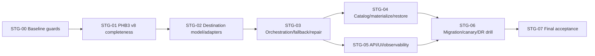

# Roadmap реализации storage reliability ProxyHarbor

## 1. Паспорт плана

- План: `storage-reliability-v1`, дата 2026-09-22, статус `IN_PROGRESS`.
- Baseline: `main@cafb95c38047f7031161fb3017774444f0da3bfb`; до аудита working tree clean.
- Scope: полнота PHB3/restore, N backup destinations, durable per-copy state, automatic backup write/read fallback, repair/failback, catalog, observability, migration and DR proof.
- Out of scope: production changes in this run; new cloud adapters without choice; generic runtime file platform; PostgreSQL HA; remote cleanup; cold archive before RTO/provider evidence.
- Current verification: GitHub CI run `35684822081` success (build, 1362 backend tests, 125 frontend tests, container and PostgreSQL backup/restore smoke). This proves current subset, not v8 completeness or real provider.
- Instructions: root `AGENTS.md`; dependency/storage changes are high risk. Final gate must follow `CONTRIBUTING.md` and CI.
- Supporting documents: [ТЗ](STORAGE_IMPLEMENTATION_TASK.md), [аудит](STORAGE_AUDIT.md), [evidence](STORAGE_EVIDENCE.md), [риски](STORAGE_RISK_REGISTER.md).

## 2. Current → target и защитные границы

Сейчас один immutable PHB3 создаётся корректно, но v7 неполон; S3/Telegram доставляются serial all-or-fail; remote copy нельзя получить через restore; state — booleans в `BackupRun`. Target: v8 covers every classified durable table; snapshot bytes создаются один раз; `BackupCopies`/jobs фиксируют каждую physical copy; pool policy требует проверенные независимые copies; fallback/reconcile/repair работают в рамках capabilities; restore доступен без production DB catalog.

Не переходить к production routing, пока не выполнены AC-002/003. Не запускать реальные provider calls без отдельного owner authorization. Не удалять legacy objects/settings и не переключать primary до remote restore gate. Не считать local volume независимой копией. Не считать job без доступных bytes защитой.

## 3. Решения и целевая policy

Используются DEC-001–010 из ТЗ. Базовая policy: `database-backup-hot`, required external verified copies = 1, desired = 1 до появления второго независимого destination; desired = 2 только после owner approval. Local PHB3 — staging. Telegram — secondary, capability-limited. S3 — hot object destination. Cold/archive deferred. PostgreSQL tables + hosted worker используются вместо broker.

## 4. Зависимости и роли

- `Codex/разработчик`: код, migrations, local fixtures/tests/docs, PR.
- `Владелец`: подтвердить RPO/RTO/retention/budget/residency; выбрать independent destinations; approve real account use and production cutover; принять residual risk.
- `Оператор`: создать buckets/service accounts/secret references, capture non-secret capability evidence, execute approved isolated drill/canary/rollback.
- External blockers: provider credentials/accounts, independent key custody, production window. Они не блокируют STG-00–05 local work.

Never request secrets in chat/issue/PR. Provider fixtures use synthetic credentials and isolated resources.

## 5. Карта этапов и зависимости

| Stage | Status | Main output | Entry | Exit |
|---|---|---|---|---|
| STG-00 | DONE locally | Characterization + model coverage guard | clean scoped branch | TEST-001 and legacy integration fixtures green |
| STG-01 | DONE / merged | Manifest v8/full restore | coverage inventory agreed | PR #262 merged after verify, PostgreSQL, analysis and CodeQL gates |
| STG-02 | DONE / merged | schema, registry, provider adapters | v8 stable | TASK-020–024 merged with green CI; routing flag off |
| STG-03 | IN PROGRESS | durable jobs/fallback/reconcile/repair | schema/adapters | TEST-004–008 local fault matrix, including failback |
| STG-04 | IN PROGRESS | independent catalog/materializer/restore | copies stable | local two-provider fixtures + isolated real-provider restore |
| STG-05 | IN PROGRESS | API/UI/metrics/runbooks | state contracts stable | UI/a11y + alert contracts + no secrets |
| STG-06 | BLOCKED by owner/external | inventory/backfill/canary/real drill | all local gates | owner-approved RPO/RTO and observation |
| STG-07 | BLOCKED | final gates/handoff | STG-06 evidence | AC-001–014 disposition and operational sign-off |

## 6. Task cards

### STG-00 — Baseline and coverage guard

Purpose: freeze existing S3/Telegram/local/restore contracts and make schema drift mechanically visible. Covers REQ-001/012, RISK-001/009.

#### TASK-001 — EF-to-backup classification contract

- Status/owner: `DONE locally`; Codex. Implemented on `feature/storage-backup-v8`.
- Inputs/dependencies: EVID-001/004–007/025; no external access.
- Changes: add proposed `BackupSchemaInventory` in `src/ProxyHarbor.Infrastructure` and `BackupSchemaCoverageTests.cs` in tests. Enumerate EF relational entity/table metadata and require exactly one classification: included entry, ephemeral (`ProxyValidationLeases`, Identity ephemeral only if justified), or external/reprovision. No string-only test that can miss model additions.
- Behavior: duplicate/unclassified/missing mappings fail with table/entity names; classification records rationale and restore action.
- Checks: focused xUnit; mutation test by adding an in-test synthetic model entity or removing one mapping; no production DB. Expected: one actionable failure, then green.
- Files: `ProxyHarborDbContext.cs` read-only reference; `BackupArchiveValidator.cs`, new inventory/test files.
- Done: every current table in EVID-001 classified; EVID/decision docs updated in implementation PR.
- Rollback: remove guard only together with all dependent v8 work; never weaken allowlist to make it pass.

#### TASK-002 — Characterization baseline for current integrations

- Status: `DONE locally`; Codex. Range, protected settings, exact S3 key/config, Telegram routes and legacy S3-before-Telegram failure order are covered.
- Changes: extend tests around `S3BackupObjectStorageTransport`, `TelegramBackupTransport`, `BackupService`, Admin settings/API and local download. Record legacy endpoint/region/path-style/prefix/key, Telegram recipient/proxy/direct/parts/error behavior, v2–v7 acceptance.
- Checks: mocked HTTP/local files only; assert secrets absent, exact object keys, Range local download, S3 failure currently blocks Telegram (characterization, then changed intentionally in STG-03).
- Compatibility: creates baseline for S3-only, Telegram-only, mixed, disabled/local-test.
- Done: TEST-005 and compatibility fixtures named and green; no behavior change.
- Failure response: stop if tests reveal undocumented production contract; update audit/decision before implementation.

### STG-01 — PHB3 v8 completeness and restore correctness

Purpose: close CRITICAL RISK-001 before multiplying copies. Covers REQ-001/002, RISK-001/003/010.

#### TASK-010 — Define and write manifest v8

- Status: `DONE / merged in PR #262`; Codex.
- Changes: `BackupService.ProduceSnapshotZipAsync`, `BackupArchiveValidator`, new typed v8 manifest. Add entries for all durable tables: API tokens/requests, referrals/rewards, metrics state, source credentials and Identity auxiliaries that can contain rows. Preserve streaming/repeatable-read/bounded entries and `secretsIncluded=false`; ciphertext secrets remain ciphertext.
- Design: manifest includes schema version and entry inventory; it does not include secret values. New archives v8 only; reader keeps v2–v7.
- Tests: validator missing/unexpected/duplicate/oversize cases; snapshot entry list equals inventory; concurrent commit consistency; paid source credential remains protected ciphertext.
- Security: no plaintext API/provider key in ZIP/log/test output.
- Done: TEST-001/003 green; archive validator strict.
- Rollback: application can revert writer to v7 only before any v8-only operational reliance; restore backward support remains.

#### TASK-011 — Complete transactional v8 restore

- Status: `DONE / merged in PR #262`; Codex.
- Changes: `src/ProxyHarbor.Restore/Program.cs` FK-safe delete/import for every included entity; full `BackupRun` columns including S3; post-import invariants. Old archives retain old semantics. New tables must never be silently left from target DB when v8 says full replacement.
- Unknown/secret handling: DP ciphertext imported exactly; operator preflight warns that DP key ring/reprovision dependencies are required without echoing data.
- Checks: cancellation before commit leaves target unchanged; cleanup failure behavior unchanged; lease fields cleared; row counts/sentinels checked inside transaction.
- Done: AC-002/003 and TEST-002 green.
- Rollback: restore binary continues reading old formats; DB migration is not required for archive v8 itself.

#### TASK-012 — Exhaustive round-trip and CI gate

- Status: `DONE / merged in PR #262`; Codex. Isolated PostgreSQL round-trip and CI PostgreSQL job are green.
- Changes: rebuild `BackupRestoreRoundTripIntegrationTests.EncryptedBackupRestoresEveryDatabaseTableAndRepresentativeField`; seed non-default sentinel in every durable table/field group, target garbage, restore, assert exact replacement/preservation by classification. Add check that test fixture list equals schema inventory.
- Checks: focused PostgreSQL integration, full backend build/test/format, existing container smoke; CI job artifact contains no backup/secrets.
- Stop conditions: any table cannot be restored safely; resolve schema/import, do not exclude it without DEC update.
- Done: RISK-001/003 status can become MITIGATED BY TEST, not operationally closed until real drill.

### STG-02 — Destination schema, capabilities and compatibility

Purpose: introduce model with routing disabled. Covers REQ-003/006/011/012/015.

#### TASK-020 — Add durable destination/copy/job schema

- Status: `DONE / merged in PR #263`; Codex.
- Changes: entities and EF mappings from TЗ §5.2; migration in `Persistence/Migrations`; readiness invariant updated. Constraints/indexes for state/verified evidence/due jobs/concurrency. `BackupRun` keeps compatibility fields.
- Backfill: migration creates no remote traffic. Seed/projection from singleton config via app startup task or explicit migration service, not SQL-decrypting Data Protection. Use idempotent marker/version.
- Checks: `dotnet ef migrations has-pending-model-changes`, PostgreSQL constraints/index tests, downgrade/forward on disposable DB, concurrent uniqueness.
- Rollback: schema additive; feature flag off. Do not drop legacy columns/config.
- Done: DB starts old config, no jobs until flag/manual canary.

Compatibility note discovered during STG-01: destination/copy/job entities add durable tables. They must not be appended to strict v8 in place, because doing so would make already-created v8 archives fail validation. TASK-020 therefore also introduces the next manifest version with an explicit inventory for these tables while retaining the frozen v8 reader.

#### TASK-021 — Adapter/capability contracts and registry

- Status: `DONE / merged`; Codex. PR #264, commit `eded71c`.
- Changes: new `IBackupDestinationAdapter`, `BackupDestinationRegistry`, typed capabilities/error codes. Register S3 and Telegram in `ServiceCollectionExtensions`/API DI. Capability is operation-specific (`put`, `verify`, `materialize`, maximum bytes, conditional create, native version/checksum); unsupported is explicit.
- Security: registry resolves allowlisted kind only; protected secrets stay provider-specific; health probe never needs delete/public ACL/list unless required.
- Tests: duplicate/missing adapter, forbidden route, read-only/quota/capability mismatch, no fallback across disallowed pool/failure domain.
- Done: REQ-011 contract green; no current public behavior changes.

#### TASK-022 — Legacy configuration projection and API compatibility

- Status: `DONE / merged`; Codex. PR #264, commit `eded71c`.
- Changes: `BackupConfigurationStore`, `BackupOptions`, Admin DTO/controller and frontend types derive legacy single S3/Telegram into destination model. Existing fields remain; credentials never returned. Add schema version to stored settings.
- Cases: disabled, S3-only, Telegram-only, mixed, legacy bot token/chat fallback, CRM recipient, cleared credentials.
- Tests: TEST-009; upgrade twice idempotent; old config unchanged when routing flag off.
- Rollback: flag-off uses old path; new rows retained for roll-forward, not deleted.
- Done: AC-004.

#### TASK-023 — Adapt S3 without breaking native keys

- Status: `DONE / merged`; Codex. PR #265, commit `5611161`.
- Changes: adapt `S3BackupObjectStorageTransport`; retain key builder/path style/endpoint validation. Capture `VersionId`/native checksum/ETag when reliable; send SDK checksum; conditional create only after provider capability confirmation. Add streaming `MaterializeAsync` to private partial + local hash + atomic publish.
- Error map: auth/config permanent; timeout/5xx/429 retryable; response lost after body sent UNKNOWN; 412 deterministic collision reconciled, not blindly overwritten.
- Tests: local S3-compatible fixture/mock verifies bytes, different endpoints/resources for independence tests; AWS behavior not assumed for all compatible providers.
- Done: TEST-004 local. Real provider remains `NOT VERIFIED` until TASK-061.

#### TASK-024 — Preserve Telegram adapter

- Status: `DONE / merged`; Codex. PR #265, commit `5611161`.
- Changes: adapter wrapper over existing resolver/transport; declare size/parts and lack of get/list/version/conditional write. Persist safe message/part evidence only if existing API response exposes it; never count partial send verified.
- Tests: every existing Telegram backup/transport test plus planner fallback and secret redaction. Non-S3 behavior must not be narrowed.
- Done: AC-011.

### STG-03 — Orchestration, failover, UNKNOWN and repair

Purpose: fulfill owner requirement without false success. Covers REQ-004–006/009/013, RISK-005/007/008/019/020.

#### TASK-030 — Protection evaluator and acknowledgement contract

- Status: `DONE / merged`; Codex. PR #267, commit `fdc88c6`.
- Changes: `BackupProtectionEvaluator`, policy snapshot on run, states `protected/degraded/pending/unavailable`; modify Admin trigger DTO/status semantics. Required vs desired copies and independent failure domains explicit.
- Checks: table-driven TEST-007; one physical copy cannot count twice; local staging excluded from external; Telegram capability mismatch excluded; no policy downgrade.
- Done: AC-005/007; API contract/OpenAPI/docs updated.

#### TASK-031 — Delivery planner, jobs and worker

- Status: `DONE / merged`; Codex. PR #268, commit `f9ba4ff`.
- Changes: `BackupService` creates/verifies one PHB3 and enqueues jobs; `BackupDeliveryWorker` leases due rows with PostgreSQL concurrency, retry/backoff/jitter/deadline. `BackupWorker` only schedules new snapshots. Preserve existing advisory/runtime gates.
- Resource budgets: bounded concurrency, no full-file buffering, local staging capacity/TTL, newest unprotected priority without starvation, graceful cancellation.
- Multi-instance tests: two workers, lease expiry/steal, crash after state transitions, restart/resume, policy version changes/draining.
- Done: durable partial success; failure of A does not prevent B.
- Rollback: routing flag stops new planner; existing new jobs retained, not discarded; compatibility worker may drain only known safe jobs or rollout pauses.

#### TASK-032 — UNKNOWN reconciliation and idempotency

- Status: `DONE / merged`; Codex. PR #269, commit `71805d1`. Provider canary remains operator-gated.
- Changes: stable BackupId/copy idempotency; deterministic S3 locator; `ProbeWriteOutcomeAsync`; states/reasons from TЗ. Never retry non-replayable stream after bytes without local immutable source. Telegram ambiguous outcomes go manual/retry policy without false verified.
- Fault tests: response lost after complete PUT, crash before/after DB update, object absent/matching/mismatching, duplicate client trigger, 409/412, corrupt metadata.
- Done: AC-006; no duplicate logical backup or overwrite.

#### TASK-033 — Operation-scoped health, budgets and automatic fallback

- Status: `IN PROGRESS / partial checkpoint merged`; Codex. PR #270 (`f39f7b9`) merged with green CI; verified-copy READ is wired into materialization and delivery via PR #281. PR #283 persists recent VERIFY outcomes across replicas; PR #286 orders pending jobs by pool-route priority. PR #287–291 retain exact typed VERIFY and durable PUT evidence, periodic read-only S3 probes and `FailbackHealthyForSeconds` scheduling hysteresis after unsafe outcomes. Parallel replicas may begin different routes at once; real provider-health proof is absent.
- Changes: health/breaker per destination+operation, short-lived local state backed by durable recent outcomes; planner enforces overall deadline and allowlisted graph. Optional storage does not fail global readiness.
- Tests: A down/B healthy; A slow leaves budget for B; auth/quota/capability; all down; cross-pool route rejected; breaker half-open; multi-instance eventual consistency.
- Numeric budgets: begin conservative test defaults, measure canary, label production values `PROPOSED` until owner accepts.
- Done: AC-005/007.

#### TASK-034 — Catch-up, repair and failback

- Status: `IN PROGRESS / local repair path`; Codex. PR #281 merged the bounded verified-copy source path for a delivery job after staging expires. PR #282 added one-copy-per-pass missing-route catch-up; PR #284 added bounded rearm only for proven pre-PUT failures. UNKNOWN or possibly-started PUT is never blindly rearmed. Healthy-window failback, interrupted backfill, restart/flapping matrix and real-provider proof remain open; this is not AC-008 completion.
- Changes: reconciler scans copy debt, chooses verified same-hash source, materializes/streams to destination, verifies, rate limits. Quarantine corruption. Healthy window/hysteresis before destination eligibility; no automatic delete.
- Historical behavior: B-only copies remain locatable; backfill coverage checkpoint blocks retirement/cleanup. Policy changes cancel/replan only safe jobs with version fencing.
- Tests: TEST-008: recovery, flapping, stale/corrupt source, concurrent repair, destination draining, restart.
- Done: AC-008.

### STG-04 — Catalog, retrieval and restore proof

Purpose: remove production-DB/VPS circular dependency. Covers REQ-007/008/014, RISK-002/004/006/010/011/016.

#### TASK-040 — Non-secret backup catalog and locator inventory

- Status: `IN PROGRESS / local implementation merged`; Codex. Strict signed schema, manual export/offline inspect, отдельный signing key, условный S3 sidecar PUT+HEAD/GET и выключенный по умолчанию durable auto-publication worker слиты в `main` через PR #274–277. Real-provider canary, независимое сохранение catalog/ключей и полный recovery drill остаются operator gates; TASK-040 пока не DONE.
- Changes: `BackupCatalogService`, strict versioned sidecar schema, export command/admin endpoint with authorized safe fields. Store alongside S3 copy; local copy; Telegram mapping only as supported. Sign/authenticate catalog or bind entries to PHB3 SHA-256; no credentials/endpoints with embedded secrets.
- Offline: operator can preserve latest inventory outside production DB and discover BackupId/locator/key version reference.
- Tests: tamper/duplicate/stale catalog, missing provider, secret scanning, DB unavailable use.
- Done: catalog can select candidate without production DB.

#### TASK-041 — Remote materialization and isolated restore workflow

- Status: `IN PROGRESS / local end-to-end recovery proof`; Codex. Подписанный catalog, отдельный provider config и выключенная по умолчанию автоматическая публикация позволяют локально проверить failover без production БД/key ring. Изолированный PostgreSQL-тест выполняет offline materialize по подписанному однокопийному sidecar после удаления исходной DB schema и затем полный restore в отдельную schema; transport в этом тесте синтетический. Реальный provider, восстановление DP key ring и полный operator drill остаются открытыми.
- Changes: extend Restore CLI or add explicit Infrastructure materializer invoked before existing restore. Accept configuration/secret references, not inline secrets; private temp partial, size/hash/native checksum, PHB3 verification then current restore. Keep local `--input` unchanged.
- Failover: try actual verified copies in read policy within total deadline; quarantine mismatch; never merge bytes/versions.
- Local checks: two isolated S3 fixtures, A unavailable/B valid, corrupted newest/B valid, all failed, cancellation/cleanup, bounded memory.
- Real check deferred to TASK-062.
- Done: AC-009 locally.

#### TASK-042 — Recovery secrets and key rotation runbook

- Status: `IN PROGRESS / local key preflight`; Codex + owner/operator gate. PHB3 `--inspect-settings` валидирует архив без БД; офлайн `dp-marker create/verify` проверяет перенос синтетического Data Protection ciphertext между изолированными копиями key ring без генерации ключей. Независимый escrow, markers каждой эпохи, representative production ciphertext и полный restore drill остаются operator gates.
- Changes: docs/config preflight for PHB3 key versions, DP key ring backup/restore and provider secret references. Add safe diagnostic that reports availability/decrypt test using synthetic marker, never key values.
- Owner actions: choose secret manager/offline escrow; store old decrypt keys for full retention; approve two custodians/locations if desired; perform isolated DP decrypt drill.
- Stop: no production DR claim while either PHB3 key or DP key ring recovery is unproven.
- Done: non-secret evidence and rotation/revocation procedure; RISK-002/004 mitigated operationally only after drill.

#### TASK-043 — Classify predeploy dumps

- Status: `PARTIAL / production read-only inventory 2026-09-24`: all 15 local dumps are mode `0600`; the retention timer is active and its last result succeeded, but the dry-run recognizes only 7 canonical files and leaves 8 legacy-name dumps outside its scope (EVID-089). No dump was removed or restored; owner review is required before targeted cleanup.
- Changes: docs and audit tooling distinguish local rollback dump from DR. Evaluate short-lived encryption/offsite delivery only after threat/restore needs; do not silently feed it into PHB3 catalog. Verify timer installation separately in approved environment.
- Tests: existing predeploy creation/retention contracts; secret/publication scanner; recovery exercise on disposable DB if changed.
- Done: REQ-014; no misleading independent-copy count.

### STG-05 — API, frontend, metrics and operations

#### TASK-050 — Admin API and UI for destinations/copies

- Status: `PARTIAL: read-only per-run protection/copy detail, paged destination/route overview, route drain, write-only S3 registration and atomic custom pool/route provisioning now have API and UI; editing existing policy and production provider proof remain`; Codex.
- Changes: `AdminController`, DTO/OpenAPI; React backup settings/history. Show pool policy, destination state, verified copies, pending/degraded/UNKNOWN, safe locator summary. Credentials write-only. Preserve old response fields.
- UI rules: use `StyledSelect`, shared Toggle/button/checkbox/table/modal patterns; explicit Lucide sizes; keyboard/focus/mobile tests per `AGENTS.md`.
- Checks: controller auth/validation, frontend interaction/a11y, desktop/mobile visual verification; full frontend lint/test/build final gate.
- Done: AC-010/011; no secret or native account IDs exposed.

#### TASK-051 — Metrics, alerts and diagnostics

- Status: `IN PROGRESS: latest-run quorum/debt, fail-closed last protected age, copy/job backlog, isolated-restore, aggregate and per-destination durable PUT/VERIFY outcomes, plus bounded staging usage/readability metrics and alerts implemented; live destination health and drill SLO gates remain`; Codex. PR #309 merged with green CI (EVID-090).
- Changes: `MetricsController`, `DiagnosticsDatabaseSnapshot`, `deploy/prometheus/alerts.yml` and tests, `MONITORING.md`. Metrics from TЗ §10 with bounded labels. Add protection age/debt/UNKNOWN/all-failed/staging/drill overdue; retain current alerts during transition.
- Health: optional destination not global readiness failure; required pool exhaustion visible separately.
- Checks: promtool contracts, metrics tests, sanitization, restored DB compatibility.
- Done: RISK-012 mitigated locally.

#### TASK-052 — Runbooks and operator commands

- Status: `IN PROGRESS: isolated full DR drill runbook drafted and synthetic HOSTKEY NL protocol canary passed; real archive recovery, independent escrow, isolated PostgreSQL restore and production rollout procedures remain`; Codex/operator.
- Changes: `BACKUP_RESTORE.md`, `DEPLOYMENT.md`, `CONFIGURATION.md`, `MONITORING.md`, `ARCHITECTURE.md`, API docs. Procedures: add/drain provider, inventory, canary, restore, UNKNOWN manual review, key rotation, all-failed, catch-up, rollback/roll-forward.
- Rules: commands default dry-run/read-only; destructive cleanup separate explicit approval; never paste secrets.
- Checks: docs links/contracts/publication gate.
- Done: another operator can perform test-environment drill from docs.

### STG-06 — Migration, canary, rollout and DR validation

Requires separate owner authorization for external writes/production. Covers REQ-005/007–010/015 and RISK-010/013/014/015/019.

#### TASK-060 — Inventory and historical backfill dry-run

- Status: `BLOCKED: STG-04 and access to production inventory; one isolated test S3 bucket exists but is not a second independent destination`; Codex/operator.
- Inputs: local archive inventory, legacy `BackupRuns`, remote provider inventory only under explicit permission.
- Steps: scan → map BackupId/hash/locator → classify unknown/orphan/conflict → create shadow copy rows → dry-run copy plan → checkpoint. No delete. Capture changes during backfill via jobs; rerun delta.
- Verification: counts/bytes/hash by destination, newest retention window protected, B-only catalog, resume after interruption.
- Rollback: shadow rows can be ignored by flag; copied objects remain immutable and cataloged. Never remove source.
- Done: signed non-secret inventory and zero unresolved critical conflicts.

#### TASK-061 — Real-provider contract and canary

- Status: `PARTIAL: isolated HOSTKEY NL synthetic PHB3/catalog canary passed 2026-09-24; second independent resource, failure paths, and production-approved archive remain NOT VERIFIED`; operator + Codex analysis. See [canary evidence](PROVIDER_CANARY_2026-09-24.md).
- Setup: isolated bucket/prefix/account, synthetic archive, least-privilege secret refs; second resource must be independent, not alias same bucket. Capture provider docs/config evidence for checksum/versioning/conditional write/Object Lock; do not infer.
- Scenarios: put/verify/get, lost response if safely simulated locally only, quota/auth, A down/B healthy without production fault injection, catalog retrieval, no secret logs.
- Rollout: enable flag for manual canary only; stop on checksum mismatch, false success, unbounded retry, secret exposure, unexpected overwrite/cost.
- Done: capability matrix upgraded from `NOT VERIFIED` only for actually tested operations.

#### TASK-062 — Isolated full restore drill and SLO measurement

- Status: `BLOCKED: production still writes incomplete PHB3 v7 (EVID-091); first an owner-approved additive flag-off deployment must produce a new v9 archive, then independent escrow of that archive/catalog/keys, isolated PostgreSQL target and explicit approval for transfer are needed`; owner/operator. Synthetic TASK-061 protocol canary alone does not clear this gate.
- Steps: take latest complete v9 prod-approved copy; start isolated DB/app; retrieve without production DB catalog; restore; provide DP keys/secret refs through approved channel; assert every sentinel/invariant; login/API token/payment/Telegram config behavior; create a new protected backup; destroy isolated environment per approved procedure.
- Measure: snapshot completion→verified copy (RPO evidence), retrieval+restore+smoke (RTO), copy lag, resource usage. No customer notification/payment calls.
- Stop: missing data/key, decrypt failure, stale copy, business invariant, cleanup incident.
- Done: AC-009/012; owner accepts or adjusts SLO.

#### TASK-063 — Production rollout and observation

- Status: `BLOCKED: the additive flag-off writer upgrade needs owner approval and a verified predeploy rollback point; routing cutover remains blocked by TASK-062 and separate approval`; operator.
- Order: additive deploy flag off → health/readiness → new v9 manual backup → isolated TASK-062 restore from independently held bytes/keys → shadow inventory → required policy canary → scheduler small scope → observe ≥2 normal intervals `PROPOSED` → enable desired second copy → keep legacy path/objects. Production v7 cannot serve as the full-restore proof for this gate (EVID-091).
- Stop/rollback: flag off for planner; no schema/data deletion; old path only if current BackupId remains accessible. If B-only data exists, keep compatibility reader and roll forward repair. Database restore is not rollback.
- Monitoring: protection/RPO/debt/UNKNOWN/staging/provider costs. No automatic failback until healthy window and catch-up.
- Done: no unresolved debt beyond accepted budget, two successful cycles, no regressions, owner sign-off.

### STG-07 — Final acceptance and handoff

#### TASK-070 — Full verification and traceability closure

- Status: `BLOCKED: STG-06`; Codex/operator.
- Run: focused tests during changes, then one final applicable gate: `dotnet build ProxyHarbor.slnx -c Release`; `dotnet test ... --no-build`; `dotnet format ... --verify-no-changes --no-restore`; PostgreSQL suite; migration pending check; frontend lint/test/build if UI changed; Compose/security/actionlint/docs/provider fixture/drill gates.
- Traceability: every REQ/RISK maps to TASK+TEST/AC; actual evidence links commit/run/resource-safe identifiers. Future tests not marked executed.
- Residuals: owner signs accepted RPO/RTO/cold tier/PostgreSQL HA/common-account risks.
- Done: AC-001–014 disposition; operational runbook and checkpoint updated.

## 7. Сквозная schema/data migration

1. Add v8 archive with no DB schema migration.
2. Add destination/copy/job tables and indexes additively; keep legacy columns/config.
3. Deploy flag off; startup/readiness checks schema only, no provider calls.
4. Application-level idempotent legacy projection decrypts old secrets through existing DP provider and writes protected destination settings; never log values.
5. Shadow inventory local/audit rows; conflicts remain manual.
6. Canary new writes; both compatibility fields and normalized rows updated transactionally where possible.
7. Backfill remote copies and delta; checkpoint hash/count.
8. Switch scheduler routing; dual-read legacy/new locators.
9. Retire serial code after observation; retain old columns for at least one compatible release.
10. Drop/cleanup only in a later separately approved migration after restore and rollback gates; not part of initial implementation.

Migration failure: transaction rollback for schema; flag-off for app; retain jobs/copies. Never re-run destructive restore as migration recovery. If write outcome unknown, reconcile first.

## 8. Backup/restore gates before dangerous actions

- Before schema migration: create current backup plus verified predeploy dump; because v7 is incomplete, database-level dump is mandatory mitigation until v8 exists. Verify on disposable target where authorized.
- Before routing cutover: v8/v9 exhaustive round-trip, approved flag-off deployment that creates a new complete archive, and one isolated restore from independently held remote bytes and keys. Existing production v7 files are not sufficient (EVID-091).
- Before second destination/backfill: inventory/dry-run and capacity/cost approval.
- Before failback/retirement: no untracked B-only copy, catch-up complete, dual-read proven.
- Before cleanup: two independent verified restore points, retention proof and explicit owner approval.

## 9. Rollout, rollback and irreversibility

Feature flags provide code-path rollback, not data rollback. Additive schema is retained. Immutable remote copies remain. Legacy object keys/local names continue. If new routing wrote only to B, turning it off must not hide B; compatibility materializer stays enabled or system rolls forward. Secret rotation is reversible only while old decrypt key remains. Remote deletion and dropping legacy schema are irreversible boundaries and are deliberately excluded from initial rollout.

## 10. Verification matrix

| Requirement/Risk | Evidence/decision | Stage/tasks | Test/AC | Environment | Expected proof | Current |
|---|---|---|---|---|---|---|
| REQ-001 / RISK-001 | EVID-004–007, DEC v8 | STG-00/01, TASK-001/010–012 | TEST-001/002, AC-002 | local PostgreSQL/CI | every durable table sentinel restored | TODO |
| REQ-002 / RISK-003 | EVID-007/016 | TASK-011/012 | AC-003 | CI | full fields, v2–v7 compatible | TODO |
| REQ-003/012 | EVID-008/014/027 | STG-02 | TEST-005/009, AC-004/011 | local mocks | legacy configs/native Telegram unchanged | TODO |
| REQ-004/005 / RISK-005 | EVID-010 | TASK-030/031/033 | TEST-006/007, AC-005 | local fault fixtures | A down, B verified, truthful status | TODO |
| REQ-006 / RISK-007 | EVID-009–011 | TASK-020/032 | TEST-004/006, AC-006 | local S3 fixtures/Postgres | UNKNOWN reconciled across restart | TODO |
| REQ-007 / RISK-006/016 | EVID-015/021 | TASK-040/041 | TEST-010, AC-009 | local then isolated real provider | restore without prod DB | TODO |
| REQ-008 / RISK-002/004 | EVID-017–018/029 | TASK-042/062 | AC-012 | isolated authorized | keys recover/decrypt | BLOCKED owner |
| REQ-009 / RISK-019/020 | DEC-010 | TASK-034/060 | TEST-008, AC-008 | local/isolated | B-only kept, safe repair/failback | TODO |
| REQ-010 / RISK-012 | EVID-023 | TASK-050/051 | AC-010 | local CI | alerts/states without secrets | TODO |
| REQ-011 / RISK-014/015 | EVID-028 | TASK-021/023/061 | TEST-004, AC-013 | local + approved provider | actual capabilities/IAM | BLOCKED external |
| REQ-013 / RISK-018 | DEC-001/003 | all docs | AC-014 | review | no false runtime HA claim | TODO |
| REQ-014 / RISK-011 | EVID-022 | TASK-043 | existing script tests | local/operator | rollback artifact classified | TODO |
| REQ-015 | DEC-010 | TASK-022/034/060/063 | AC-004/008/014 | local→prod | dual-read and no lost B-only | TODO |

## 11. Fault scenarios mandatory before acceptance

- A connection refusal/DNS/timeout/429/5xx/auth/quota; B healthy.
- A write completes and response/DB update is lost; reconcile matching/missing/conflicting object.
- Telegram part N fails; no verified status.
- Snapshot creation/PHB3 verify fails; no destination success can mask it.
- All destinations down with staging capacity, then capacity exhausted.
- Worker crash/restart/lease expiry; two instances compete.
- Policy/destination becomes draining during job.
- Copy corrupt/stale; alternate verified generation served; corruption quarantined.
- Recovery/flapping; catch-up backlog bounded; newest protected first.
- Backfill interrupted; resume and delta preserve new copies.
- Local file/production DB unavailable; catalog+remote copy+keys restore isolated app.
- Legacy disabled/S3-only/Telegram-only/mixed configurations and old v2–v7 archives.
- Large file cancellation and bounded memory/disk/network.

## 12. Commands and evidence levels

Focused commands use exact test filters once tests exist. Final commands follow AGENTS §Risk-based verification. Local MinIO/mock results are `VERIFIED BY TEST`, never “provider verified”. Real provider canary is `OBSERVED TEST ACCOUNT EVIDENCE`; production state only `OBSERVED RUN EVIDENCE`. Each command record includes commit, environment, exit code, scenario and sanitized artifact hash. Avoid inherited production environment variables; fixtures use isolated generated config.

## 13. Owner/operator decisions and blockers

Needed before STG-06, not before local development:

1. Confirm or change `PROPOSED` RPO 24h/RTO 4h, required=1 and desired=2 external copies.
2. Select one/two independent hot destinations and legal region/residency; create resources and least-privilege secret references.
3. Decide retention and whether Object Lock/versioning is mandatory; provide non-secret configuration evidence.
4. Establish PHB3 old-key and Data Protection key-ring custody; do not send values.
5. Authorize isolated real-provider canary and restore drill, then production window.
6. Decide separately whether PostgreSQL HA and monitoring/Caddy volume backup are required.

No dates are invented. STG-00–05 may proceed without these decisions using isolated fixtures.

## 14. Deferred / not applicable

- New provider adapters: `DEFERRED` until selected; registry suffices.
- Runtime file upload/download, presigned URLs, multipart sessions, soft delete/tombstones: `NOT_REQUIRED` because no runtime file objects. If introduced later, reopen architecture before implementation.
- Cold/archive: `DEFERRED` until RTO/restore-time/cost evidence.
- Automated remote delete/lifecycle: `DEFERRED` beyond first release.
- PostgreSQL HA: `DEFERRED` separate infrastructure roadmap.
- GeoIP backup: `NOT_REQUIRED`, reconstructible cache.
- WAL/incremental chain: `NOT_REQUIRED` for full-snapshot PHB3; managed DB PITR may be separate future scope.

## 15. Status log and checkpoint

| Date | Revision | Change | Evidence |
|---|---|---|---|
| 2026-09-22 | plan v1 | Initial audit/ТЗ/Roadmap; no implementation. | EVID-001–030 |
| 2026-09-22 | implementation checkpoint 1 | Added exhaustive 39-table classification, strict PHB3 v8 inventory, full v8 writer/transactional restore, S3 audit fields, legacy characterization and exhaustive sentinels for previously omitted tables. | EVID-031–035 |
| 2026-09-22 | merged checkpoint 1 | PR #262 merged to `main` after verify, PostgreSQL integration, C#/JS analysis and CodeQL succeeded. | EVID-036 |
| 2026-09-22 | implementation checkpoint 2 | Added additive destination/pool/copy/job/restore-verification schema, routing kill switch off, strict PHB3 v9 while preserving frozen v8, and real PostgreSQL constraint/round-trip coverage. | EVID-037–039 |
| 2026-09-22 | merged checkpoint 2 | PR #263 merged to `main` after verify, PostgreSQL integration, C#/JS analysis and CodeQL succeeded. | EVID-041 |
| 2026-09-22 | implementation checkpoint 3 | Added allowlisted S3/Telegram adapter registry, typed capabilities/errors and idempotent legacy configuration projection; routing remains off and no jobs are created. | EVID-042–044 |
| 2026-09-22 | merged checkpoint 3 | PR #264 merged to `main` after verify, PostgreSQL/API smoke, C#/JS analysis and CodeQL succeeded; startup retry-strategy regression was fixed before merge. | EVID-046 |
| 2026-09-22 | implementation checkpoint 4 | Added S3 detailed PUT/HEAD/streaming GET evidence and safe failure map; Telegram adapter now wraps existing resolver/runtime multipart transport and preserves legacy protected credentials. | EVID-047–048 |
| 2026-09-22 | merged checkpoint 4 | PR #265 merged to `main`; verify/container smoke, PostgreSQL/API smoke, C#/JS analysis and CodeQL all succeeded. | EVID-049 |
| 2026-09-22 | implementation checkpoint 5 | Added immutable run policy/content snapshot, fail-closed protection evaluator and `200/202/503` acknowledgement contract; local PostgreSQL 17 and restore coverage are green. | EVID-050–051 |
| 2026-09-22 | implementation checkpoint 6 | Added atomic per-destination planner and leased delivery worker with bounded retry/deadline, crash-to-UNKNOWN semantics, independent fallback, staging byte/TTL budgets and routing disabled by default. | EVID-054–055 |

| 2026-09-23 | merged checkpoints 7–10 | PR #281–284 merged into `main`: verified remote-source delivery, bounded missing-route catch-up, durable VERIFY health and isolated S3 canary script, bounded proven pre-PUT rearm. PR #284 passed PostgreSQL, verify/container smoke, C#/JS analysis and CodeQL. | EVID-070–073 |

Current merged checkpoint: `main@f2c1e46` contains STG-00–02 and TASK-020–032 with green CI. TASK-033/034 and STG-04 remain partial. PR #281–284 added remote-source delivery, missing-route catch-up, durable VERIFY outcomes, a dry-run-tested HOSTKEY NL canary, and bounded pre-PUT rearm; PR #285 updated the evidence. `FailbackHealthyForSeconds` is not enforced; no real-provider S3 canary, independent key escrow, isolated real-provider restore, historical backfill, production rollout or two observed scheduled cycles have been proven. Routing remains disabled by default. Next local implementation: design/test a durable healthy-window failback eligibility gate without treating a completed copy or passive wait as fresh provider health. Next external gate: authorized canary in the isolated test bucket after a locally protected credential file is available.

Merged checkpoint `main@aa3d687`: PR #286 passed CI and put pool-route priority before job creation time for pending claims of one run (EVID-074). This is scheduling order only, not automatic failback or serialized cross-replica delivery.

Merged checkpoint `main@900ef46`: PR #287–292 passed CI, store exact typed VERIFY and per-attempt PUT outcomes, add bounded read-only S3 recovery probes, gate primary scheduling priority on post-failure PUT plus a matching probe window, and support secure interactive credential entry in the isolated S3 canary (EVID-075–080). `missing`, `mismatching`, inconclusive, a legacy null result, or elapsed time alone cannot prove recovery. Local per-run admin protection/copy detail is the next partial STG-05 slice; real-provider canary, historical repair and isolated restore remain open gates.

Merged checkpoint `main@73be7d1` (2026-09-24): PR #304–306 passed CI and added write-only disabled S3 registration plus atomic custom pool/route provisioning in the API and admin UI (EVID-087). An isolated HOSTKEY NL synthetic PHB3/catalog protocol canary passed, including addressed cleanup (EVID-086); this does not prove recovery of a real archive or an independent second provider.

Read-only VPS checkpoint against `main@c0895a5` (2026-09-24): the dedicated SSH key restored access. Five containers are healthy, but checkout `981c1ca02` is 50 commits behind `main`, and current API environment has no `BackupRouting__*` variables. Seven local PHB3 files and one DP XML exist; they are not restore evidence. API logs show one controlled lifetime-lock shutdown and five EF transaction errors in 24 hours; PostgreSQL had no matching ERROR/FATAL/PANIC in sampled windows (EVID-088). Local predeploy dump retention leaves eight legacy-name files outside its dry-run scope (EVID-089). No production write or deletion was performed. Next gates: owner approval for transferring real encrypted archive/key material to an isolated PostgreSQL target, independent escrow and key rotation after chat disclosure, then complete offline DR; production rollout needs a separate deployment decision.

Merged monitoring checkpoint `main@b343984` (2026-09-24): PR #309 passed verify/container smoke, PostgreSQL integration and CodeQL after its smoke assertion was updated from 34 to 36 alert rules. It reports only service-owned published PHB3 staging bytes, a separate readability bit, the configured cap and two bounded alerts (EVID-090). This improves local staging visibility but does not prove offsite recovery, live provider health, drill SLO or production deployment. The owner approval and isolated target for real-archive DR remain outstanding.

Read-only production inventory checkpoint against `main@e0d531b` (2026-09-24): the same VPS checkout is now 53 commits behind and contains a v7 writer. Seven recent local PHB3 match their completed DB runs by filename and byte count, but their internal manifest was not decrypted or inspected; all seven were marked delivered only to Telegram, and no S3 destination was configured. Eighteen current rows occupy tables excluded from v7, so backups made by this writer cannot satisfy a complete restore. The newest predeploy dump is from 2026-09-21 on the same VPS. This changes rollout order: an approved flag-off writer upgrade and fresh v9 backup must precede the real isolated drill; no automatic routing cutover or deletion is justified (EVID-091).

## 16. Регламент продолжения в новой сессии

1. Read root instructions plus all six reports; compare current branch/commit/diff to baseline.
2. If schema/code changed, rerun EF/archive comparison and update IDs without resetting completed evidence.
3. Select first `READY` task whose dependencies are DONE; do not skip stage gates.
4. Implement one bounded task, run focused tests, update task/evidence/risk status truthfully.
5. Before PR/push/publication run the one applicable full gate specified by AGENTS; CI remains mandatory.
6. Never mark real-provider/DR evidence complete from mocks. Never access accounts or production without explicit permission.
7. At stage end update this checkpoint, actual commit/run links, residual risks and next task.
8. If a gate fails, stop dependent work, preserve diagnostics, fix or mark BLOCKED; do not weaken tests/policies.

## 17. Operational readiness definition

Ready means: v8 exhaustive restore; legacy compatibility; N destinations and truthful protection states; A→B write fallback and verified-copy read fallback; UNKNOWN/restart/catch-up/failback tests; catalog independent of production DB; recoverable keys; isolated real-provider restore within accepted SLO; metrics/alerts/runbooks; two observed scheduled cycles; no unresolved critical risk; full CI/security/migration/frontend/docs gates. Anything less is a development milestone, not “идеальная” or guaranteed availability.
