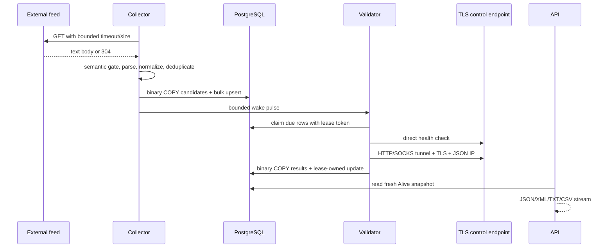

# Архитектура ProxyHarbor

## Цели системы

ProxyHarbor решает пять независимых задач:

1. регулярно обнаруживать кандидатов во внешних бесплатных feed’ах;
2. безопасно нормализовать и дедуплицировать недоверенные данные;
3. объективно проверять каждый proxy через настоящий сетевой протокол;
4. быстро публиковать только свежие подтверждённые результаты;
5. сохранять операционное состояние в шифрованном восстанавливаемом backup.

Система не считает наличие адреса в feed доказательством работоспособности. Collection и validation разделены, чтобы временная недоступность контрольной инфраструктуры, медленный feed или большой backlog не смешивали разные виды состояния.

## Компоненты

| Компонент | Ответственность |
|---|---|
| `ProxyHarbor.Domain` | Persistence-agnostic сущности, enum и стабильные контракты |
| `ProxyHarbor.Infrastructure` | EF Core/Npgsql, migrations, source catalog, collector, parser, probes, workers, backup |
| `ProxyHarbor.Api` | REST/OpenAPI, public/admin contracts, rate limits, caching, security middleware, metrics |
| `ProxyHarbor.Restore` | Offline inspection и транзакционное восстановление PHB2/PHB3 |
| `proxyharbor-web` | React dashboard и административная панель |
| PostgreSQL | Очередь, evidence, leases, audit и distributed coordination |
| Caddy | Единственная production HTTPS-точка входа |
| Prometheus/Alertmanager | Opt-in наблюдаемость и Telegram alerts |

## Поток данных

## Collection pipeline

### Каталог

Встроенный каталог компилируется в приложение и содержит 310 HTTPS endpoint от 80 независимых provider identities. GitHub raw feed считается принадлежащим owner репозитория; остальные — DNS hostname. Startup seed синхронизирует канонические URL, protocol, name и priority, сохраняя операторский `Enabled`.

### Загрузка

- одновременно обрабатывается не более `SourceConcurrency` feed’ов;
- один ответ ограничен 10 МБ и `SourceTimeoutSeconds`;
- transient network/5xx повторяются, постоянные 4xx — нет;
- ETag и безопасный Last-Modified поддерживают conditional fetch;
- не реже bounded freshness interval выполняется полный unconditional fetch;
- ручной admin collection всегда требует новый body каждого включённого feed’а;
- HTML media type или HTML/WAF envelope отклоняется до parser.

### Parser и дедупликация

Parser принимает только bounded token:

- `IPv4:port`;
- `[IPv6]:port`;
- `http://`, `https://`, `socks4://`, `socks5://` с каноническим IP;
- для строки без scheme используется `DefaultProtocol` источника.

Hostname-прокси, private/loopback/link-local/documentation/benchmark/special-use адреса, port вне `1..65535`, неоднозначный decimal IPv4 и endpoint внутри большего identifier отклоняются. Компактный value-key хранит IP как два `ulong`, protocol/port/family как value fields; строка создаётся только перед persistence.

`MaxProxiesPerSource` ограничивает один feed, `MaxCandidatesPerRun` — общий набор. Флаги `LastResultTruncated`, `SourcesTruncated` и `CandidateLimitReached` делают потерю полноты наблюдаемой.

## Validation pipeline

### Распределённая очередь

PostgreSQL claim query использует `FOR UPDATE SKIP LOCKED`, status priority и `NextCheckAt`. Каждая строка получает `CheckLeaseId` и `CheckLeaseUntil`. Несколько API-реплик арендуют непересекающиеся партии; heartbeat продлевает lease. Результат применяется только при совпадении exact lease token.

Порядок:

1. новые `Pending`;
2. due `Alive`;
3. due `Dead` с adaptive exponential retry.

### Control health

Перед арендой validator напрямую проверяет доверенный HTTPS control endpoint. DNS разрешается перед фактическим socket connect, private/special address блокируется, redirect и системный HTTP proxy отключены, body ограничен 16 КБ.

Если control endpoint недоступен, очередь не арендуется. Если неоднозначность возникла после открытия proxy tunnel, результат помечается `Deferred`: попытка аудируется, но status, latency и quality counters прокси не меняются.

### Proxy protocols

- HTTP/HTTPS category: HTTP CONNECT до control host;
- SOCKS4: IPv4 либо SOCKS4a hostname;
- SOCKS5: IPv4, IPv6 либо domain address type;
- после handshake всегда выполняется системная TLS certificate validation;
- HTTP response разбирается bounded byte parser с точным framing;
- informational 1xx ограничены, 101 и неоднозначный body framing отклоняются;
- exit IP канонизируется и сравнивается с origin IP для определения анонимности.

Latency измеряет полный путь proxy handshake → TLS → control response, а не только TCP connect.

## Модель данных

| Таблица | Назначение |
|---|---|
| `Proxies` | Endpoint, status, latency, exit IP, quality counters, schedule и lease |
| `Sources` | URL/protocol, conditional validators, freshness, failures и completeness evidence |
| `Runs` | Постоянный аудит collection cycle |
| `ValidationRuns` | Claimed/checked/alive/deferred, lease, duration и result validation batch |
| `BackupRuns` | Создание файла, размер, Telegram configuration/delivery и итог |

Database constraints дополнительно защищают enum, port, non-negative counters, timelines, lease consistency, run totals, status evidence и Telegram delivery. Readiness выполняет zero-row schema probe актуальных таблиц/колонок, поэтому доступная, но устаревшая БД возвращает `503`.

## Публикация

Публичный каталог включает только:

- `Status=Alive`;
- непустую измеренную latency;
- хотя бы один successful check;
- `LastCheckedAt` не старше `PublicFreshnessMinutes`.

Стабильный порядок: latency по возрастанию → successful checks по убыванию → UUID. Для больших обходов используется keyset cursor, связанный с fingerprint фильтров.

Обычная страница и агрегаты читаются из PostgreSQL `REPEATABLE READ` snapshot. React-таблица использует точные серверные `page/pageSize/total`, а полный машинный обход — keyset cursor. Streaming export использует отдельный non-retrying context: после отправки первых байтов операция никогда не повторяется. Один export ограничен пятью минутами, 50 000 строками и одним из двух process-wide slots.

У каждой строки сохраняются `FirstAliveAt`, `LastAliveAt` и `CurrentAliveSince`. Успех начинает или продолжает Alive-серию, объективный Dead завершает её, Deferred историю не меняет. Retention удаляет только старые адреса без единой успешной проверки; однажды работавшие прокси остаются в PostgreSQL как история.

## Coordination и отказоустойчивость

### Advisory locks

- startup migrations/seed — exclusive startup lock;
- collection — cluster-wide exclusive lock;
- source mutation — shared lock относительно collection;
- backup — cluster-wide exclusive lock;
- maintenance — отдельный lock;
- API lifetime — shared database runtime lease;
- restore — exclusive database runtime lease.

API lease удерживается owning PostgreSQL session от startup до shutdown и проверяется каждые пять секунд. Потеря сессии вызывает controlled shutdown. Restore не может пересечься с живой API-репликой или уже начатой write-operation.

### Crash recovery

Следующий владелец operation lock переводит orphan `running` audit в `failed`. Validation lease истекает автоматически. Backup удаляет только точно принадлежащие ему legacy ZIP, `.partial` и `partNNN-of-NNN`; похожие пользовательские файлы volume не затрагиваются.

## Backup architecture

Под одной repeatable-read транзакцией девять таблиц (proxy/audit и Identity/subscription) и safe settings сериализуются в ZIP, который сразу передаётся через bounded pipe в PHB3 encryptor. Plaintext ZIP на backup volume не создаётся. Ciphertext полностью self-verifies, durable flush выполняется до atomic rename. Только после этого запускаются retention и Telegram delivery.

Подробности и schema: [BACKUP_RESTORE.md](BACKUP_RESTORE.md).

## Trust boundaries

1. External feeds — полностью недоверенные body/headers/DNS.
2. Proxy servers — недоверенный transport до системно проверяемого TLS.
3. Control endpoint — доверенный HTTPS origin, но bounded parser всё равно обязателен.
4. Browser/account session — ASP.NET Identity хранит пользователей, роли, lockout, password hashes, reset tokens и стабильный `PreferredLanguage`; вход принимает логин, email или обмен действующего API-токена, а браузер получает HttpOnly Secure SameSite=Strict cookie и не хранит исходные credentials. API-токен состоит из публичного идентификатора и 256-битного секрета, хранится только как SHA-256, ограничен `catalog:read`, показывается один раз и перепроверяет подписку при каждом использовании. Один языковой профиль применяется к UI, API culture, письмам и Telegram; неизвестный код безопасно откатывается к русскому.
5. Subscription entitlement — роль отвечает за доступ к функциям, а отдельная `UserSubscription` хранит тариф и жизненный цикл будущего billing provider; публичные лимиты пока не включены.
6. Telegram — внешний API; response/exception sanitizing не допускает token/chat ID в audit.
7. Backup archive — аутентифицируется PHB3 и строго валидируется до destructive restore.
7. Reverse proxy headers — принимаются только от явно заданной CIDR и одного hop.

Полный анализ: [../SECURITY.md](../SECURITY.md).

## Масштабирование

- API/read traffic масштабируется обычными репликами.
- Validator масштабируется горизонтально через PostgreSQL leases.
- Collector и backup исполняются одной репликой за цикл благодаря advisory locks.
- Для API-only реплики можно отключить `BackgroundWorkersEnabled`, но хотя бы одна production-реплика должна выполнять workers.
- PostgreSQL остаётся authoritative coordinator и требует мониторинга CPU, I/O, connections, autovacuum и disk.

Настройка и измеренные пределы: [PERFORMANCE.md](PERFORMANCE.md).
